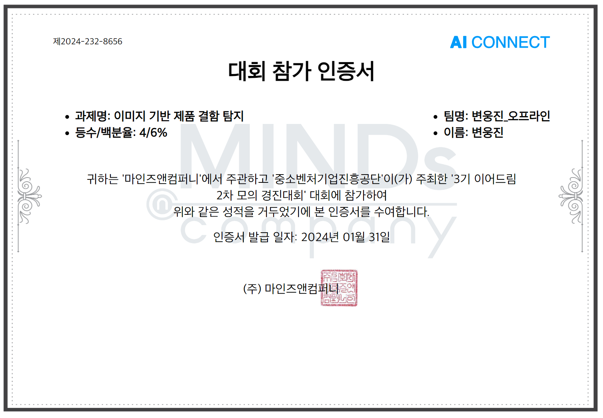

# 이미지 기반 제품 결함 탐지
"AI Connect 모의경진대회" 

제품 이미지에 결함이 존재하는지 여부를 판별하는 과제 "Anormaly Detection Task"

**주최**: 중소벤처기업진흥공단

**주관**: 마인즈앤컴퍼니 (AI Connect)

<br>

## OverView

### 대회소개:
Texture surface에 존재하는 결함 여부를 탐지합니다. 결함/정상 여부를 분류하는 Binary Classification 문제입니다.

**제한사항**: 외부데이터 사용불가

**참여기간**: 2023.09.27 ~ 10.06

**참여방식**: 개인

<br>

## 데이터

### 데이터 구조
```
data
├ train
│  ├ defect_images
│  │  ├ defect_0000.png 
│  │  ├ defect_0001.png
│  │  └ ...
│  ├ defect_masks
│  │  ├ defect_0000.png 
│  │  ├ defect_0001.png
│  │  └ ...
│  └ normal_images
│     ├ normal_0000.png
│     ├ normal_0001.png
│     └ ...
│
└ test
   ├ images
   │  ├ test_0000.png 
   │  ├ test_0001.png
   │  └ ...
   └ sample_submission.csv
```

### 데이터 설명

**traing data**
- train / defect_images: 결함 제품 이미지 (30장) 
- train / defect_masks: 결함 부분 세그멘테이션 마스크 (30장) 
- train / normal_images: 정상 제품 이미지 (6,790장)

<br>

**test data**
- test / images: 결함/정상 포함 이미지(9,100장)

<p align='center'></p>

<br>

**sample_submission.csv** (9100 rows X 2 columns)
- test/images에 존재하는 테스트 이미지 9,100장에 대한 판별 결과 (정상 : 0, 결함 1)을 제출.
- 컬럼명 일치 필수 (ImageId, answer)
- shape 일치 필수 (9100, 2)

<br>

## 평가지표

- Macro F1 Scores: 각 클래스의 F1 Score의 단순 평균.

<br>

$$ F1 \ Score = \frac{2}{\frac{1}{Precison} + \frac{1}{Recall}} = 2 \ ⨉ \ \frac{Precision \ ⨉ \ Recall}{Precision \ + \ Recall} $$

<br>

<p align='center'></p>

- Considers both Precision and Recall, Precision과 Recall의 조화평균 평균 ( Best Score = 1.0 )

<br>

- 테스트 데이터 분할
<p align='center'></p>

<br>

## EDA **Class Imbalance Problem**

우선 주어진 데이터의 분포를 살펴보면 **Class imbalance** 문제가 있다는 것을 알 수 있습니다.

<p align='center'></p>
<p align='center'></p>

우선 주어진 데이터로 "resnet18d"를 백본으로 하여 간단히 학습해본 결과 

<p align='center'></p>

accuracy 점수는 높게나오나 평가지표인 F1 Score는 0.50을 넘지 못하며 학습이 제데로 이루어지지 않는 것으로 확인했습니다.

<br>

## 데이터 증강 **Data Augmentation**

데이터 세트에서 "Class imbalance"을 처리하는 대표적인 방법
- 다수 클래스에 대해 **언더샘플링**$^{\textrm{Under Sampling}}$ 을 수행, 다수 클래스와 관련된 특정 수의 샘플을 제거. 
- 소수 클래스에 대해 **오버샘플링**$^{\textrm{Over Sampling}}$ 을 수행, 소수 클래스와 관련된 샘플의 반복을 수반.

두 가지 전략 중 하나가 데이터세트의 균형을 맞추더라도 클래스 불균형으로 인한 문제를 직접적으로 해결하지는 않고 오히려 새로운 문제가 발생할 위험도 있습니다. 오버샘플링은 중복된 샘플을 도입하므로 훈련 속도를 쉽게 늦추고 모델의 과적합으로 이어질 수도 있습니다. 반면에 **언더샘플링**은 특정 수의 샘플을 제거합니다. 이로 인해 모델이 언더샘플링의 결과로 제거된 샘플에서 학습할 수 있었던 특정 중요한 개념을 학습하지 못하게 될 수 있습니다.

이번 문제의 경우 **여러 표면에 대한 anormal 사례의 특징을 학습하는 것이 중요함**으로 **적은 클래스**에 대한 **오버샘플링을 진행**했습니다. 따라서 코랩에서의 상대적으로 오랜 학습시간이 필요했습니다. 대신 적은 클래스를 어떻게 데이터증강을 할지에 대하여 고민이 있었습니다.

<p align='center'></p>

적용한 데이터 증강방법은 30장 밖에 없는 소수 detect 클래스를 효과적으로 증강하기 위해 10도씩 이미지를 로테이션시켜 1080장의 이미지로 증강시켰습니다.
참고로 이미지 회전으로 생긴 여백이 학습에 여향을 끼칠수 있다는 우려가 있어보이나, 자동 rgb(0,0,0)의 값으로 채워지기에 학습되지 않는다고 판단했고 결과적으로 평가지표 비교시에도 학습되지 않는다고 판달 할 수 있었습니다.  

<p align='center'></p>

<p align='center'></p>

데이터증강 후 훈련지표에서 높은 성능개선이 있었으나 에폭이 늘어날 수록 불안정하게 다시 loss가 증가하는 경우가 발생하였고

현재 1:6.5 비율도 부족하다고 판단, 

주어진 데이터 이미지가 상하 좌우의 방향성이 없는 특성을 이용,
반전 및 회전을 복합으로 사용하여 약 1:2 비율까지 이미지를 증강했습니다.
 
``` python
from PIL import Image, ImageOps

augmented_images = []
angles = np.arange(0, 360, 10)  # 회전 각도

for image_path in train_defect_images:  # detect images 30개
       img = Image.open(image_path)

    for flip_func in [None, ImageOps.flip, ImageOps.mirror]:   # 상하 / 좌우 반전 
        flipped_img = img if flip_func is None else flip_func(img)

        for angle in angles:
            rotated_img = flipped_img.rotate(angle) # 이미지 회전 
            augmented_images.append(rotated_img)
```

<p align='center'></p>

<br>

## 모델선정 및 훈련

효과적인 이미지 분류를 하기위해서 **transfer Learning** 이라는 **전이학습**을 주로 하게 됩니다. 

그러면 기존에 미리 학습된 CNN 계열의 유명 네트워크 모델을 이용 (VGG, ResNet, Inception 등) 미리학습된 architecture에 주어진 task에 대한 학습만 추가로 하여 효과적인 이미지 인식이 가능합니다. 

kaggle과 같은 경진대회에서 널이 사용되는 Backbone 모델 중 **"EfficientNet"** 이 적은 파라미터 대비 정확한 인식률을 보여주어 자주 사용되고 있어 이번 기회에 사용해 보고자 했습니다. 

<p align='center'></p>

데이터 증강을 통해 class imbalance를 문제를 해결하고, efficientNetb5 을 백폰으로 전이학습을 진행하여 지표들을 확인해본 결과. <br>
(옵티마이저는 adamW 사용, 손실함수는 Binary Cross Entropy Loss 사용)

첫번째 에폭에도 높은 성을을 보여주었고 10번째 에폭에선 train 데이터셋과 valid 데이터셋 안의 모든 이미지를 정확하게 분류해낸 만점도 기록했습니다.

```
train-0: 100%|██████████| 878/878 [14:40<00:00,  1.00s/it]
val-0: 100%|██████████| 377/377 [06:29<00:00,  1.03s/it]
metric_best (0.000000 --> 0.992360). Saving model ...
Epoch: 0
Train Loss: 0.06585066250967955
Val Loss: 0.029421902560586955
Train Acc: 0.9804871100982766
Val Acc: 0.9933532735127949
Train F1: 0.9775540319852074
Val F1: 0.9923598958772383
- - - - - - - - - - -
train-1: 100%|██████████| 878/878 [03:32<00:00,  4.13it/s]
val-1: 100%|██████████| 377/377 [00:26<00:00, 14.46it/s]
metric_best (0.992360 --> 0.998859). Saving model ...
Epoch: 1
Train Loss: 0.007962988683877415
Val Loss: 0.0030391411216806347
Train Acc: 0.9981484119071358
Val Acc: 0.9990029910269193
Train F1: 0.9978829966754607
Val F1: 0.9988592848864914
- - - - - - - - - - -
- - - - - - - - - - -
train-3: 100%|██████████| 878/878 [03:32<00:00,  4.13it/s]
val-3: 100%|██████████| 377/377 [00:26<00:00, 14.50it/s]
metric_best (0.998859 --> 1.000000). Saving model ...
Epoch: 3
Train Loss: 0.0030925798635829975
Val Loss: 6.398881491056927e-05
Train Acc: 0.9992878507335138
Val Acc: 1.0
Train F1: 0.9991857679521002
Val F1: 1.0
- - - - - - - - - - -
- - - - - - - - - - -
- - - - - - - - - - -
- - - - - - - - - - -
- - - - - - - - - - -
train-8: 100%|██████████| 878/878 [03:32<00:00,  4.13it/s]
val-8: 100%|██████████| 377/377 [00:26<00:00, 14.37it/s]
Epoch: 8
Train Loss: 3.13362775178251e-05
Val Loss: 0.0003098654430651361
Train Acc: 1.0
Val Acc: 0.9996676636756398
Train F1: 1.0
Val F1: 0.9996199665939396
- - - - - - - - - - -
train-9: 100%|██████████| 878/878 [03:32<00:00,  4.12it/s]
val-9: 100%|██████████| 377/377 [00:26<00:00, 14.35it/s]
Epoch: 9
Train Loss: 0.01091686147519067
Val Loss: 0.00044408685966267926
Train Acc: 0.997721122347244
Val Acc: 1.0
Train F1: 0.9973947578267657
Val F1: 1.0
- - - - - - - - - - -
train-10: 100%|██████████| 878/878 [03:32<00:00,  4.12it/s]
val-10: 100%|██████████| 377/377 [00:26<00:00, 14.38it/s]
Epoch: 10
Train Loss: 9.992701545523394e-05
Val Loss: 4.766755378403379e-05
Train Acc: 1.0
Val Acc: 1.0
Train F1: 1.0
Val F1: 1.0
- - - - - - - - - - -
- - - - - - - - - - -
- - - - - - - - - - -
```

<p align='center'></p>

약간의 진폭이 있으나 에폭이 진행될수록 높은 성능을로 수렴된다고 판단할 수 있었습니다. 

<br>

## 결과

64명 인원 중 4위를 달성했으며

대회 최고 점수는 Macro F1: 0.9990 이며, 달성한 점수는 Macro F1: 0.9833 이었습니다.

<p align='center'></p>

<br>

## 한계점 및 회고

- 제출 시 실수가 있었습니다. <br> 학습을 진행시 best F1 스코어 달성시 자동저장이 되도록 설정했지만 이는 vaild 데이터 셋에서만 적용되고 추후 더 학습이 진행되면서 만점 지표가 더 나왔지만 같은점수로 인식, 저장되지 않았습니다. 

- 결국 3에폭에 저장된 체크포인트로 inference된 submission이 제출되었습니다.
- 다시 학습하여 더 나은 지표로 저장된 체크포인트로 추론해 제출하기에는 시간제약에 걸리고 말았습니다.
- Macro F1 Score 0.98 이상의 점수를 보인 참가자들은 모두 비슷한 f1 score, loss 그래프 를 보여주었고 결국 섬세하게 체크포인트를 관리해 제출한 사람들이 높은 점수를 얻게 되었습니다.
